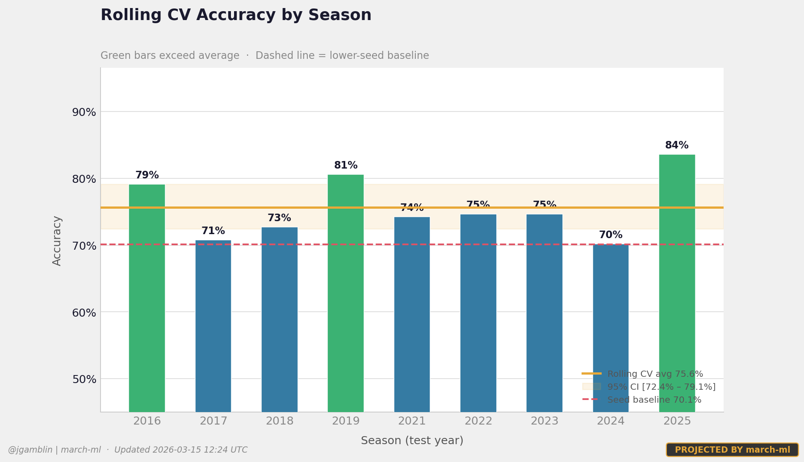
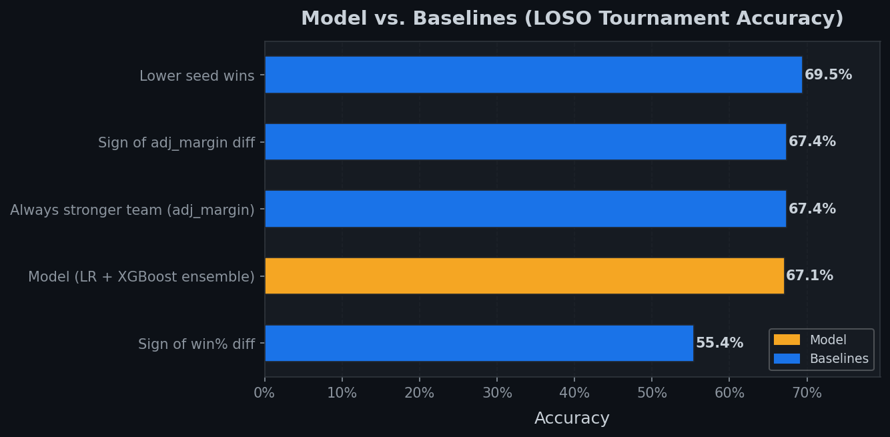
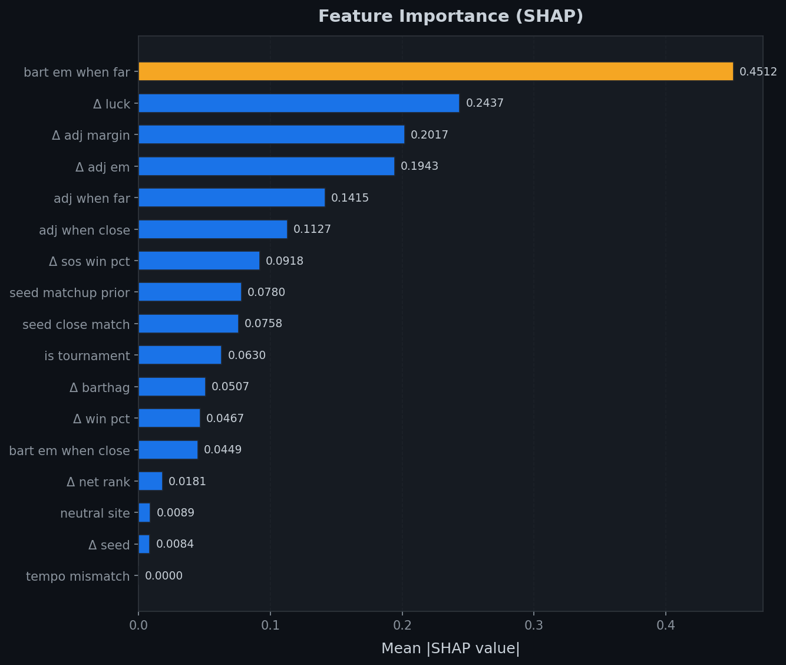
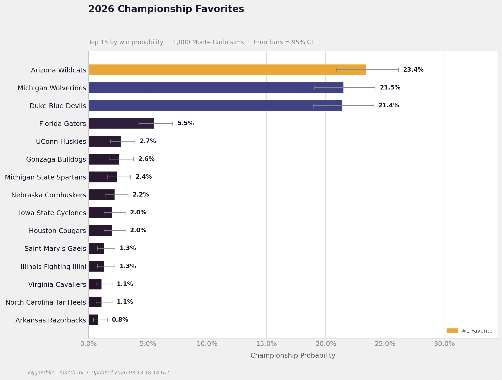

# march-ml

NCAA men's basketball tournament prediction pipeline — scrape game data, engineer pre-tournament features, train a calibrated LR + XGBoost ensemble, simulate bracket outcomes with Monte Carlo, and generate strategy-aware pool entries.

[](https://www.python.org/)
[](https://scikit-learn.org/)
[](https://xgboost.readthedocs.io/)

---

## Current metrics (seasons 2021–2026)

| Metric | Value |
|--------|-------|
| **Rolling CV accuracy** | **73.8%** |
| Rolling CV 95% CI | [72.4%, 75.2%] |
| Lower-seed baseline | 69.5% |
| **Model vs baseline** | **+4.3 pp** ✅ |
| LOSO accuracy (tournament-only training) | 67.4% |
| Tournament games evaluated | 334 |
| Features | 9 |
| Training rows (with regular season) | ~33 000 |
| Seasons of data | 2021–2026 |

> **Primary metric: Rolling CV.** Each season is held out in turn while the model trains only on *past* seasons — the same condition as real deployment. LOSO (which can train on future seasons to predict the past) is tracked separately but is not the headline metric.

### Why rolling CV > LOSO for this problem

LOSO holds out 2021 but trains on 2022–2025, using future data to predict the past. For a model deployed to predict each March's tournament, rolling CV (train on seasons 1..k-1, predict season k) is the only leakage-free evaluation.

### Rolling CV accuracy by season



### Model vs baselines



### Feature importance (SHAP)



---

## Pipeline


---

## Quickstart

```bash
python -m venv .venv
source .venv/bin/activate
pip install --no-user -r requirements.txt   # --no-user required inside venv

# Fast end-to-end smoke test
python scripts/run_pipeline.py --mode smoke

# Full pipeline: scrape → features → train → 5000 sims
python scripts/run_pipeline.py --mode full --sims 5000 --sim_out results/sim_5000.json
```

---

## Commands

### Scrape data
```bash
python scripts/run_pipeline.py --mode scrape
```

### Build features
```bash
python scripts/run_pipeline.py --mode features --seasons 2021 2022 2023 2024 2025 2026
```

### Train models

```bash
# Tournament games only (334 rows — fast, interpretable)
python scripts/run_pipeline.py --mode train

# Recommended: augment with regular-season games at reduced weight
python scripts/run_pipeline.py --mode train --include_regular_season

# Training flags
#   --include_regular_season        add ~33K regular-season rows at weight 0.3
#   --regular_season_weight FLOAT   sample weight for regular-season rows (default: 0.3)
#   --interactions                  add quadratic interaction features (off by default — overfits)
```

### Simulate bracket

```bash
# With official bracket (recommended after Selection Sunday)
python scripts/run_pipeline.py --mode simulate --sims 5000 \
  --bracket_file data/brackets/official_2026.csv --official_bracket \
  --sim_out results/sim_2026_official.json

# Projection using top-64 by adj_margin (pre-Selection Sunday)
python scripts/run_pipeline.py --mode simulate --sims 5000 \
  --sim_out results/sim_2026_5000.json
```

### Pool optimizer
```bash
python scripts/run_pipeline.py --mode optimize --sim_out results/sim_2026_official.json \
  --strategy balanced --num_entries 10

# Strategies: chalk | balanced | contrarian
```

### Generate charts
```bash
python scripts/generate_charts.py --sim results/sim_2026_5000.json
# Outputs: results/charts/loso_by_season.png
#          results/charts/model_vs_baselines.png
#          results/charts/champion_probs_2026.png
```

### View results
```bash
python show_results.py                          # auto-detects latest sim
python show_results.py results/sim_2026_5000.json
```

---

## Repo layout

```
data/
  processed/          scraped game CSVs and box scores (games_YYYY.csv, boxscores_YYYY.csv)
  processed/features/ engineered feature CSVs (tournament_teams.csv, seeds_all.csv, …)
  brackets/           bracket input files (official_2024.csv, template_64.csv)
  mappings/           D-I normalization and conference mapping inputs

models/               trained model artifacts + training_summary.json
results/              simulation outputs (sim_*.json) and charts/
scripts/              all pipeline scripts (see table below)
```

### Script reference

| Script | Purpose |
|--------|---------|
| `run_pipeline.py` | Orchestrator — chains all stages via `--mode` |
| `scrape_with_cbbpy.py` | Pulls game + box score data via `cbbpy` |
| `prepare_features.py` | Builds leakage-free pre-tournament team snapshots |
| `train_baseline.py` | Trains LR + XGBoost ensemble with LOSO evaluation |
| `cross_validate_models.py` | Standalone LOSO + rolling cross-validation |
| `simulate_bracket.py` | Monte Carlo bracket simulation |
| `optimize_entries.py` | Strategy-aware bracket entry portfolio generation |
| `pool_scorer.py` | Scores brackets; ESPN/CBS/simple scoring profiles |
| `parse_bracket.py` | Parses official NCAA bracket CSV/JSON |
| `validate_artifacts.py` | Validates simulation JSON schema |
| `generate_charts.py` | Generates accuracy, SHAP importance, and champion-probability charts |
| `optimize_ensemble_weights.py` | LOSO-based grid search for optimal LR/XGB blend; writes `models/ensemble_weights.json` |
| `train_seed_stratified_models.py` | Per-seed-stratum model variants |
| `fetch_official_bracket.py` | Polls ESPN API for official bracket on Selection Sunday |

---

## Automation (GitHub Actions)

Three workflows keep the repo self-updating:

| Workflow | Trigger | What it does |
|---|---|---|
| **update-data.yml** | Every 6 hours + manual | Scrape → features → train → 5000-sim → commit results |
| **bracket-watch.yml** | Every 15 min on Selection Sunday + manual | Polls ESPN for bracket; triggers 10 000-sim run when found |
| **scrape-and-save.yml** | Manual only (legacy) | Raw data artifact only, no retrain |

### How results get committed back

The `update-data.yml` job has `permissions: contents: write` and pushes three
artefacts back to `main` after each run (only when files actually changed):

```
results/sim_*.json        — latest Monte Carlo simulation
results/charts/           — champion-probability and accuracy charts
models/training_summary.json — LOSO metrics from the most recent train
```

Auto-commit messages include `[skip ci]` to prevent recursive workflow
triggers.

### Raw-data caching

`data/raw/` (cbbpy pickle files) is cached in GitHub Actions with a
weekly-rotating key. This means scraping all five seasons costs one network
round-trip per week; subsequent 6-hour runs skip the API calls entirely and
rebuild features from cache.

### Selection Sunday automation

`bracket-watch.yml` polls ESPN's public tournament API every 15 minutes from
March 14 evening through March 16 morning (UTC). When 68 real team names
appear in the response (not "TBD"), the script:

1. Writes `data/brackets/official_{year}.csv`
2. Commits it to `main`
3. Kicks off `update-data.yml` with `--bracket_file` and 10 000 sims

To test manually:
```bash
python scripts/fetch_official_bracket.py --year 2026 --dry_run
```

To force a re-fetch even if the file already exists:
```
GitHub Actions → bracket-watch → Run workflow → force: true
```

---

## Methodology

### Features (9 total, all computed pre-tournament)

Each training example is a matchup `(team_A, team_B)` expressed as the **difference** in each team's features (`diff_*`), plus three context features:

| Category | Features |
|----------|---------|
| Schedule strength | `diff_adj_margin` (Massey-style 2-iteration), `diff_sos_win_pct` |
| Season stats | `diff_win_pct` |
| Conference | `diff_conf_strength_tier` |
| Momentum | `diff_form_rating` |
| Tournament | `diff_seed`, `neutral_site`, `is_tournament` |
| Prior knowledge | `seed_matchup_prior` (40-year historical 1v16, 5v12 … win rates — hardcoded constants, no leakage) |

> `tournament_teams.csv` contains **pre-tournament snapshots** built from non-postseason games only. Never use `teams.csv` (full-season) for training — it leaks postseason results.

> `adj_margin` uses a 2-iteration Massey correction: `adj_i = avg_margin_i + mean(adj_j for all opponents j)`. This correctly rates teams that dominate weak conferences lower than teams that play competitive schedules.

### Label orientation

cbbpy consistently assigns the better team as "home" in tournament game records (even though all games are played at neutral sites). This creates ~67% positive-label bias. **Fix:** each matchup row is reoriented so `team_A` = higher `adj_margin` team; the label is flipped accordingly.

### Seed extraction

cbbpy stores the tournament seed in `home_rank`/`away_rank` for NCAA tournament games. `prepare_features.py` extracts these automatically — no external seed file required. Seeds (1–16) are merged into `tournament_teams.csv` each time features are rebuilt.

### Model calibration

Both models are wrapped with `CalibratedClassifierCV`:
- Logistic Regression → sigmoid (Platt scaling)
- XGBoost → **isotonic regression** (sigmoid is designed for SVMs; wrong for tree ensembles)

### `build_match_dataset` return signature

```python
X, y, meta, weights = build_match_dataset(games_dir, features_df, game_scope, ...)
```

Returns **4 values**. `weights` is a float array (1.0 = tournament, `regular_season_weight` = regular season). All callers must unpack 4 values.

---

## Bracket file formats

### Official bracket (`--official_bracket` flag)

```csv
team,seed,region,slot
Duke Blue Devils,1,East,1
American University,16,East,2
```

### Legacy formats (no `--official_bracket` flag)

- **Plain text** — one team per line, bracket order
- **CSV** — `team` column, optional `slot`, `seed`, `region`
- **JSON** — list of `{team, seed, region, slot}` objects

Adjacent slots (1–2, 3–4, …) are paired in round 1.

---

## Known limitations

- **Small tournament sample**: only 334 historical tournament matchup rows across 5 complete seasons; high variance in per-season estimates.
- **Conference strength partial**: `conf_strength_tier` is a rough 3-level mapping; full inter-conference win% matrix not yet implemented.
- **No player-level data**: injuries, roster experience, and height are not currently modeled. A manual `overrides.csv` mechanism is planned for Selection Sunday.
- **cbbpy API fragility**: if ESPN changes their API schema during tournament week, scraping fails. Use `data/manual_features_template.csv` as a fallback — see [Troubleshooting](#troubleshooting) below.

---

## Troubleshooting

**Models not found**
```bash
python scripts/run_pipeline.py --mode train --include_regular_season
```

**`pip install` fails inside venv**
```bash
pip install --no-user -r requirements.txt
```
Global `pip.conf` may have `user = true`; `--no-user` overrides it inside a virtualenv.

**Features out of date**
```bash
python scripts/run_pipeline.py --mode features --seasons 2021 2022 2023 2024 2025 2026
```

**Smoke test to validate pipeline**
```bash
python scripts/run_pipeline.py --mode smoke
```

**cbbpy scraping fails during tournament week**

If the ESPN API is down or has changed schema, use the manual features fallback:

```bash
# 1. Copy the template
cp data/manual_features_template.csv data/processed/features/tournament_teams.csv

# 2. Fill in the 64 team rows using KenPom, Bart Torvik, or ESPN BPI for these 8 columns:
#    season, team, seed, adj_margin, win_pct, sos_win_pct, conf_strength_tier, form_rating
#    (see the header comments in the template for field definitions and typical ranges)

# 3. Train and simulate as normal
python scripts/run_pipeline.py --mode train --include_regular_season
python scripts/run_pipeline.py --mode simulate --sims 1000
```

The 9th model feature (`seed_matchup_prior`) is computed automatically from the hardcoded 40-year prior table — no data entry required.

---

## 2026 season

A pre-Selection Sunday projection (top-64 by adj_margin) has been run:



> ⚠️ This does **not** reflect the actual tournament field. Re-run after Selection Sunday (March 15, 2026) with the official bracket:
> ```bash
> python scripts/simulate_bracket.py --sims 5000 --season 2026 \
>   --bracket_file data/brackets/official_2026.csv --official_bracket \
>   --out results/sim_2026_official.json
> ```

